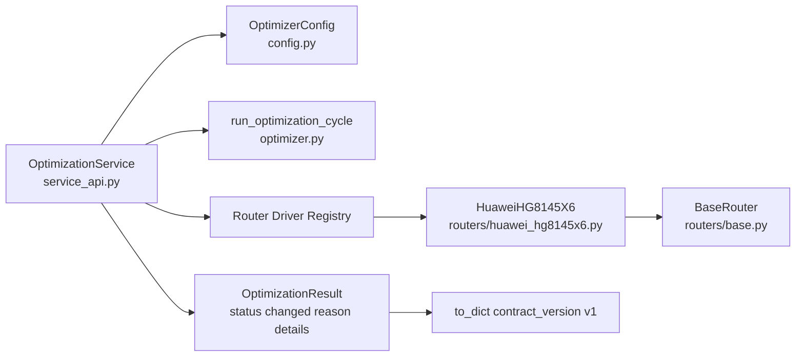
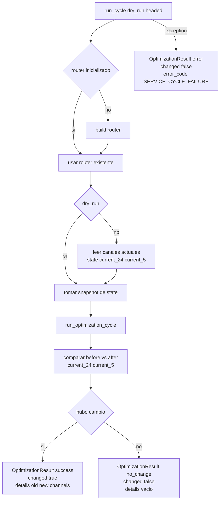
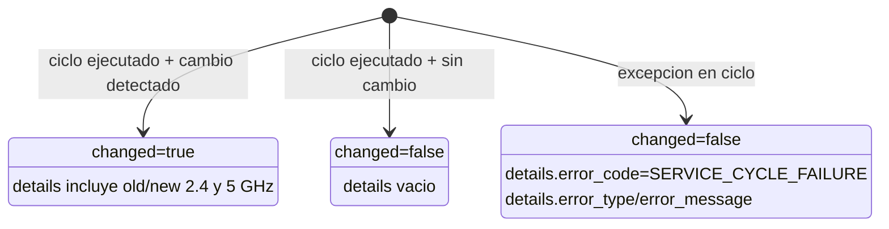

# Service API Overview (`v1`)

Este documento presenta de forma visual la capa `service_api` para entender rapido como se ejecuta un ciclo y como se expone el contrato estable hacia servicio/IPC.

## 1) Rol de `wifi_optimizer/service_api.py`

- Expone `OptimizationService` como wrapper seguro para servicio (sin `sys.exit()`).
- Estandariza salida con `OptimizationResult`.
- Publica `contract_version` en cada payload (`v1`).
- Encapsula inicializacion del router y manejo de errores normalizado.

## 2) Componentes y dependencias



## 3) Flujo de `run_cycle()`



## 4) Estado de salida (`OptimizationResult`)



## 5) Contrato de respuesta (`to_dict()`)

Payload base serializable:

```json
{
  "contract_version": "v1",
  "status": "success | no_change | error",
  "changed": true,
  "reason": "...",
  "details": {}
}
```

## 6) Notas operativas importantes

- Validaciones de constructor:
  - `config` debe ser `OptimizerConfig`.
  - `router_driver` no puede estar vacio.
- `status` usa `Literal` para mantener contrato acotado.
- La deteccion de cambio se basa en snapshot pre/post (`current_24/current_5`).
- Error normalizado para IPC/servicio: `SERVICE_CYCLE_FAILURE`.
- `dry_run` actualmente no introduce estado dedicado; tipicamente termina en `no_change`.

## 7) Referencias

- `wifi_optimizer/service_api.py`
- `docs/architecture/SERVICE_API_CONTRACT_V1.md`
- `tests/test_service_api.py`


